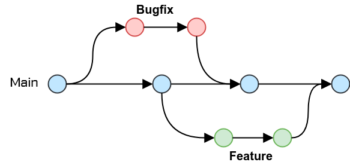

# Git workflow

## Context

In our software development process, we need to define a clear and consistent Git workflow for managing our source code.
This decision is crucial to ensure efficient collaboration, version control, and code quality within our development
teams.

## Decision

After careful evaluation and consideration, we have decided to adopt the GitHub Flow as our primary workflow for
managing code repositories on GitHub.
GitHub Flow is a lightweight, branch-based workflow designed for teams that value simplicity and rapid delivery

## Rationale

The decision to adopt GitHub Flow is based on the following factors:

- Simplicity: GitHub Flow is straightforward and easy to understand, making it accessible to both new and experienced
  developers. Its simplicity ensures that our development teams can quickly adapt and adopt the workflow.

- Single Main Branch: GitHub Flow centers around a single main branch, usually named main or master, promoting a clean
  and straightforward codebase. This simplifies the management of the project's version history.

- Feature Branches: Developers work on new features or bug fixes in isolated branches, facilitating parallel development
  without disrupting the main codebase. Pull Requests (PRs) are used to propose and review changes before they are
  merged.

- Continuous Delivery: GitHub Flow aligns well with a continuous delivery approach. Code changes are continuously
  integrated, reviewed, and deployed to the main branch, making it easy to release new features or bug fixes as soon as
  they are ready.

- Collaboration and Code Review: PRs in GitHub Flow encourage collaboration and code review. All changes are reviewed
  before merging, helping maintain code quality and consistency.

- Integration with GitHub: GitHub Flow is tightly integrated with GitHub's features, such as GitHub Actions for CI/CD,
  and the Projects and Issues for tracking and managing work items, which streamlines the development process.

- Community Support: GitHub Flow is widely used and supported by the GitHub community, ensuring access to documentation,
  best practices, and tools that can aid in its adoption.

## Consequences

The adoption of GitHub Flow will have the following implications:

- Training and Onboarding: We will need to provide training and onboarding for development teams to ensure they are
  familiar with GitHub Flow, PR best practices, and GitHub's features.

- Documentation: We should create and maintain documentation on how to use GitHub Flow within our organization to ensure
  consistency in its application.

- Integration with GitHub Tools: We will need to configure and possibly develop tools and workflows to integrate GitHub
  Flow with our CI/CD pipelines, code quality checks, and project management processes.

- Code Review Processes: Clear guidelines should be established for code reviews, including who reviews PRs, what the
  criteria for merging are, and how to handle disagreements or issues raised during reviews.